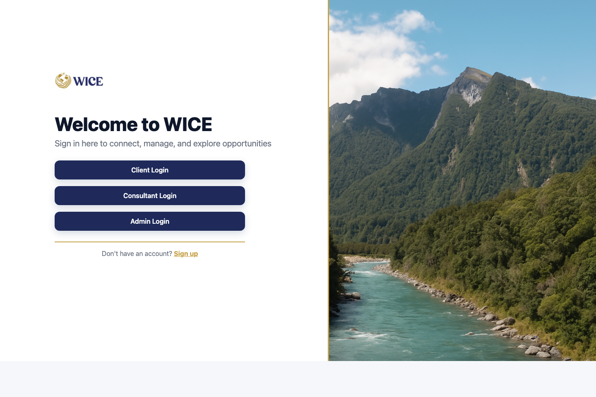
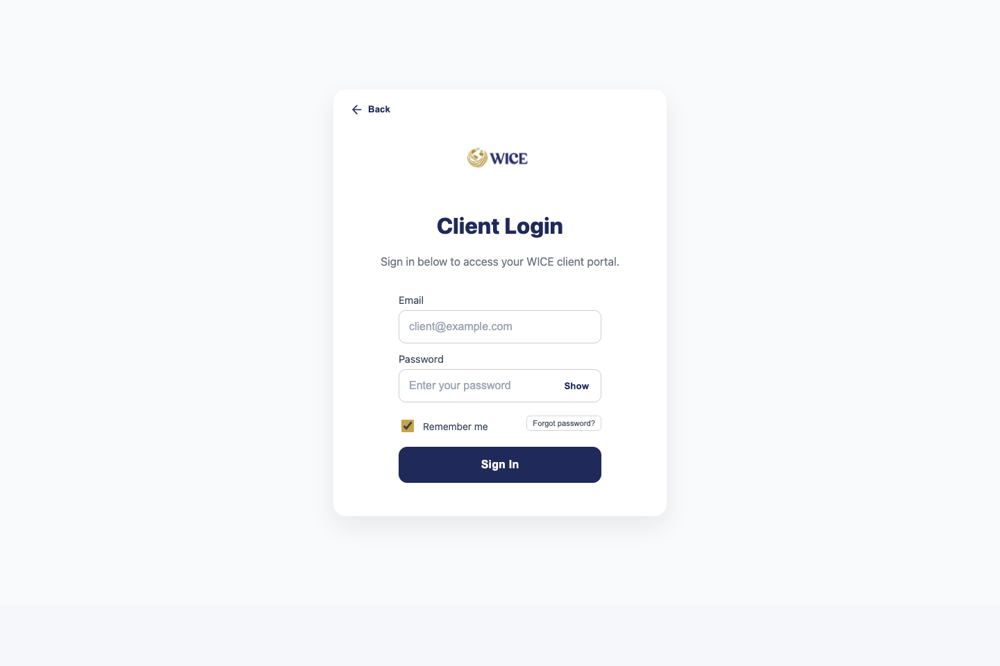
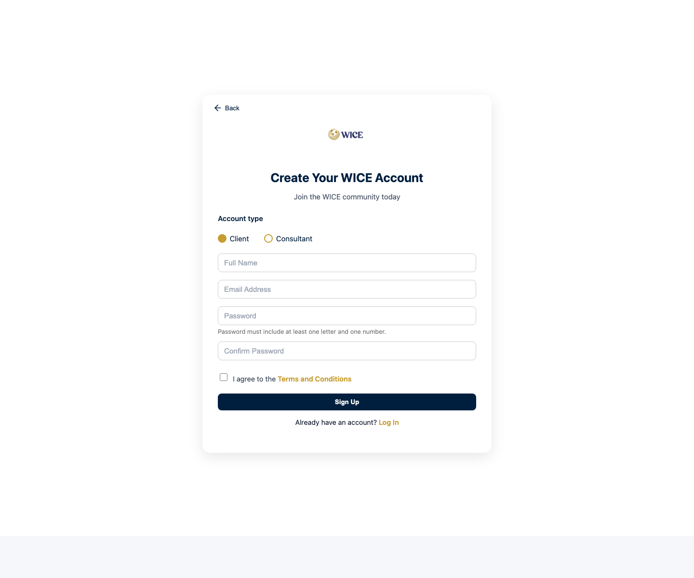
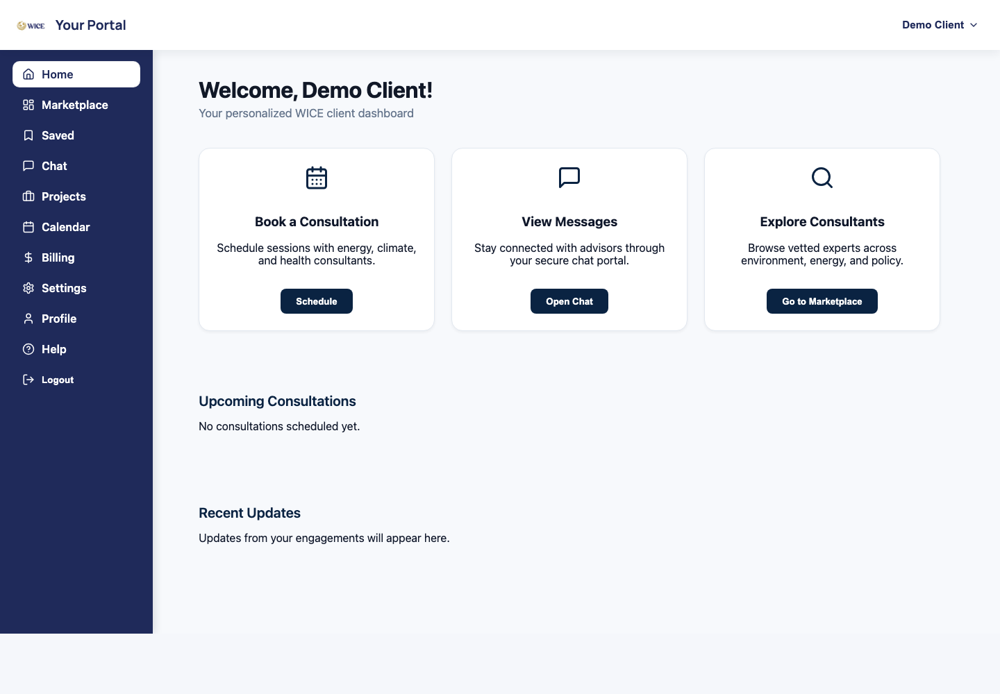
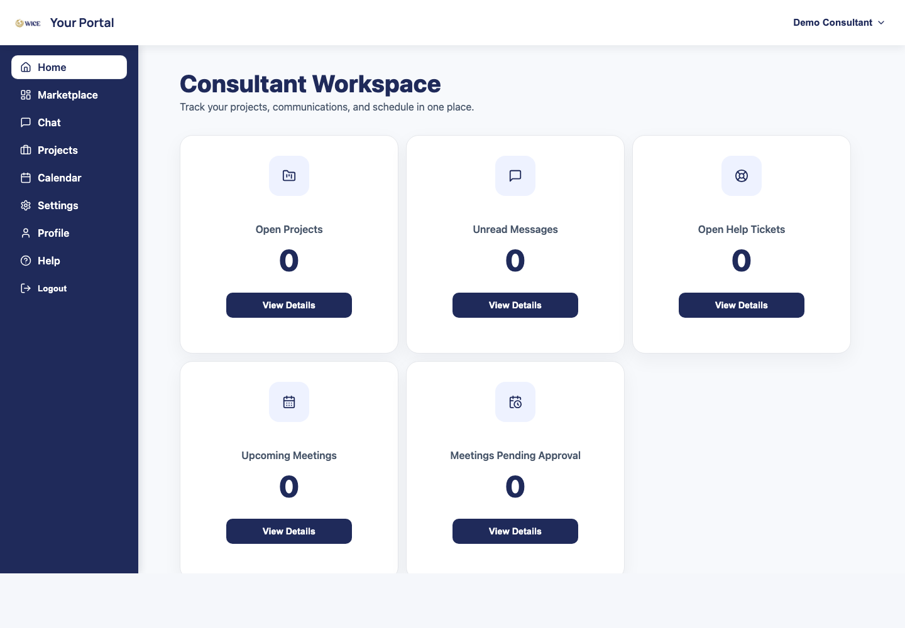
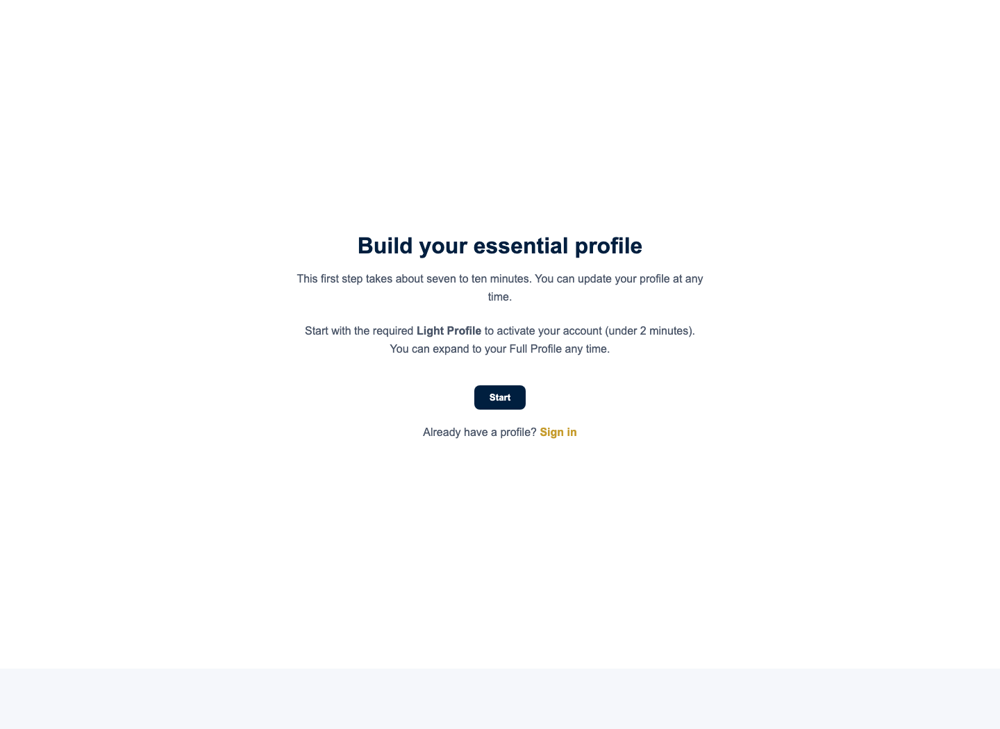
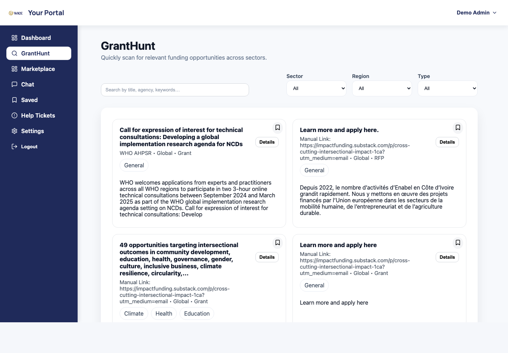
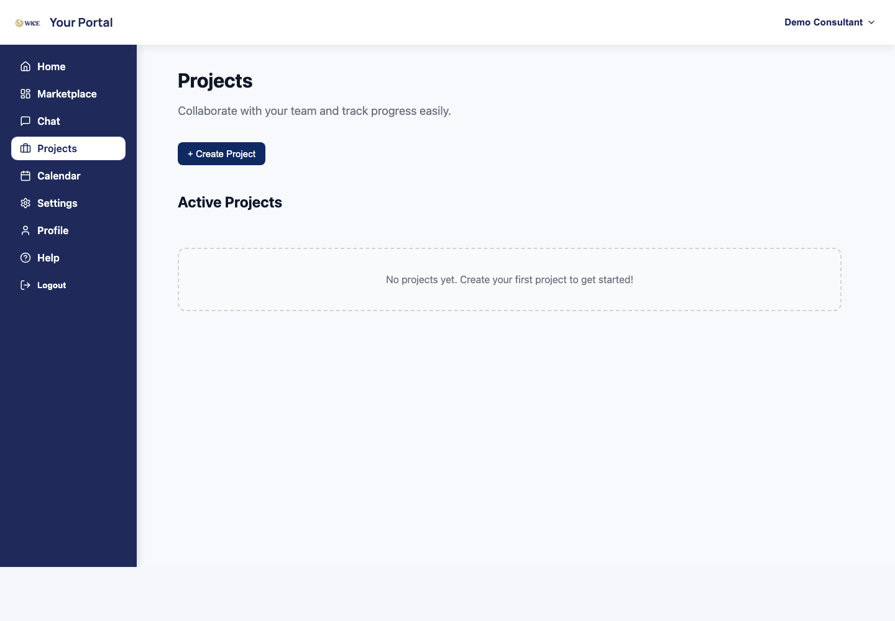
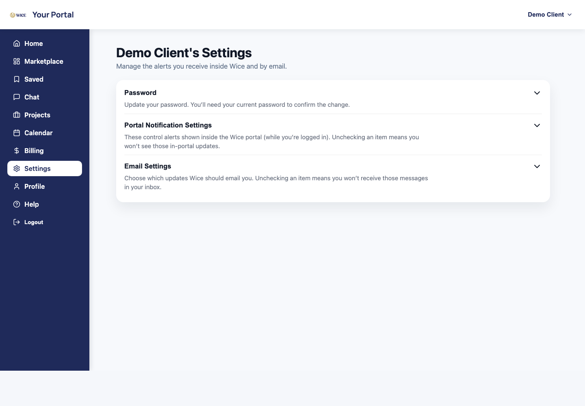

<p align="center">
  
</p>

<h1 align="center">WICE Platform</h1>

<p align="center">
  A React and Firebase workspace for matching clients with consultants, managing projects and chats, tracking grants, and administering platform activity.
</p>

<p align="center">
  <a href="#screenshots">Screenshots</a> |
  <a href="#quick-start">Quick Start</a> |
  <a href="#environment">Environment</a> |
  <a href="#security">Security</a> |
  <a href="#project-map">Project Map</a>
</p>

<p align="center">
  
</p>

## Screenshots

### Public Entry

<table>
  <tr>
    <td width="50%">
      
      <br />
      <strong>Role-based portal entry</strong>
      <br />
      Separate client, consultant, and admin paths keep each workflow focused.
    </td>
    <td width="50%">
      
      <br />
      <strong>Account creation</strong>
      <br />
      New users choose a client or consultant profile before entering the app.
    </td>
  </tr>
</table>

### Signed-In Workflows

<table>
  <tr>
    <td width="50%">
      
      <br />
      <strong>Client dashboard</strong>
      <br />
      Clients can jump into consultations, messages, marketplace discovery, and recent updates.
    </td>
    <td width="50%">
      
      <br />
      <strong>Consultant workspace</strong>
      <br />
      Consultants can scan projects, unread messages, help tickets, and meeting activity.
    </td>
  </tr>
  <tr>
    <td width="50%">
      
      <br />
      <strong>Profile builder</strong>
      <br />
      New consultants are guided through the required profile setup before entering the platform.
    </td>
    <td width="50%">
      
      <br />
      <strong>GrantHunt</strong>
      <br />
      Funding opportunities can be searched, filtered, reviewed, and saved from one workspace.
    </td>
  </tr>
  <tr>
    <td width="50%">
      
      <br />
      <strong>Projects</strong>
      <br />
      Consultants and clients can track active work and project collaboration.
    </td>
    <td width="50%">
      
      <br />
      <strong>Settings</strong>
      <br />
      Users can manage account security and notification preferences.
    </td>
  </tr>
</table>

## What WICE Includes

- Consultant marketplace with searchable skills, industries, locations, and availability.
- Client and consultant dashboards for profiles, projects, saved items, calendar, and messages.
- GrantHunt workspace for scanning funding opportunities.
- Admin views for user management, account status, help content, and platform analytics.
- Firebase Authentication, Firestore, Storage rules, and Cloud Functions support.

## Quick Start

```bash
git clone https://github.com/<your-org>/<your-repo>.git
cd Wice/WiceApp
npm install
cp .env.example .env.local
npm run dev
```

Open the local Vite URL printed in the terminal, usually `http://localhost:5173`.

## Environment

Create `WiceApp/.env.local` from `WiceApp/.env.example` and fill in values from your Firebase project settings or secure team password manager.

```bash
VITE_FIREBASE_API_KEY=
VITE_FIREBASE_AUTH_DOMAIN=
VITE_FIREBASE_PROJECT_ID=
VITE_FIREBASE_STORAGE_BUCKET=
VITE_FIREBASE_MESSAGING_SENDER_ID=
VITE_FIREBASE_APP_ID=
VITE_FIREBASE_MEASUREMENT_ID=
VITE_PROTECTED_ADMIN_EMAIL=

FIREBASE_API_KEY=
FIREBASE_PROJECT_ID=
FIREBASE_IMPORT_EMAIL=
FIREBASE_IMPORT_PASSWORD=
```

The crawler reads optional OpenAI settings from the shell environment:

```bash
export OPENAI_API_KEY="<set-in-your-local-shell-or-secret-manager>"
export OPENAI_MODEL="gpt-4.1-mini"
```

## Common Commands

Run these from `WiceApp/` unless noted.

```bash
npm run dev
npm run lint
npm run build
npm run preview
```

Cloud Functions are optional during frontend work.

```bash
cd functions
npm install
npm run serve
```

## Firebase

This repo is structured for Firebase-backed development:

- `firebase.json` wires Firestore, Storage rules, and Cloud Functions.
- `.firebaserc` selects the active Firebase project for deploy commands.
- `firestore.rules`, `firestore.indexes.json`, and `storage.rules` live at the repo root.
- `functions/` contains Firebase Admin helper functions.

For deployments, authenticate with Firebase CLI and select the intended project before deploying.

```bash
firebase login
firebase use <firebase-project-id>
firebase deploy --only firestore,storage,functions
```

## Security

No production credentials, personal passwords, import passwords, API keys, private tokens, or demo account passwords should be committed to this repository or written into README files.

- Keep local secrets in `WiceApp/.env.local`; it is ignored by git.
- Keep shared credentials in a password manager or deployment secret store.
- Share demo credentials privately instead of documenting passwords in source control.
- Rotate any credential that was previously copied into docs, commits, screenshots, logs, or crawler output.
- Review generated crawler output before committing. HTTP headers, cookies, and debug logs can contain sensitive values.

## Project Map

```text
.
+-- WiceApp/                  # React/Vite frontend
|   +-- src/Pages/            # Client, consultant, admin, chat, profile, and project views
|   +-- src/Components/       # Shared UI components
|   +-- src/context/          # Auth and chat providers
|   +-- src/services/         # Firebase data access helpers
|   +-- src/data/             # Taxonomy, grant, skills, and terms data
|   +-- src/crawler/          # Grant source crawler utilities
+-- functions/                # Firebase Cloud Functions
+-- docs/screenshots/         # README screenshots captured from the app
+-- firestore.rules           # Firestore security rules
+-- firestore.indexes.json    # Firestore index definitions
+-- storage.rules             # Firebase Storage rules
+-- firebase.json             # Firebase project configuration
```

## Documentation Notes

The screenshots in `docs/screenshots/` were captured from public screens and locally generated dummy sessions. They do not use real account records, private messages, passwords, or admin data.
